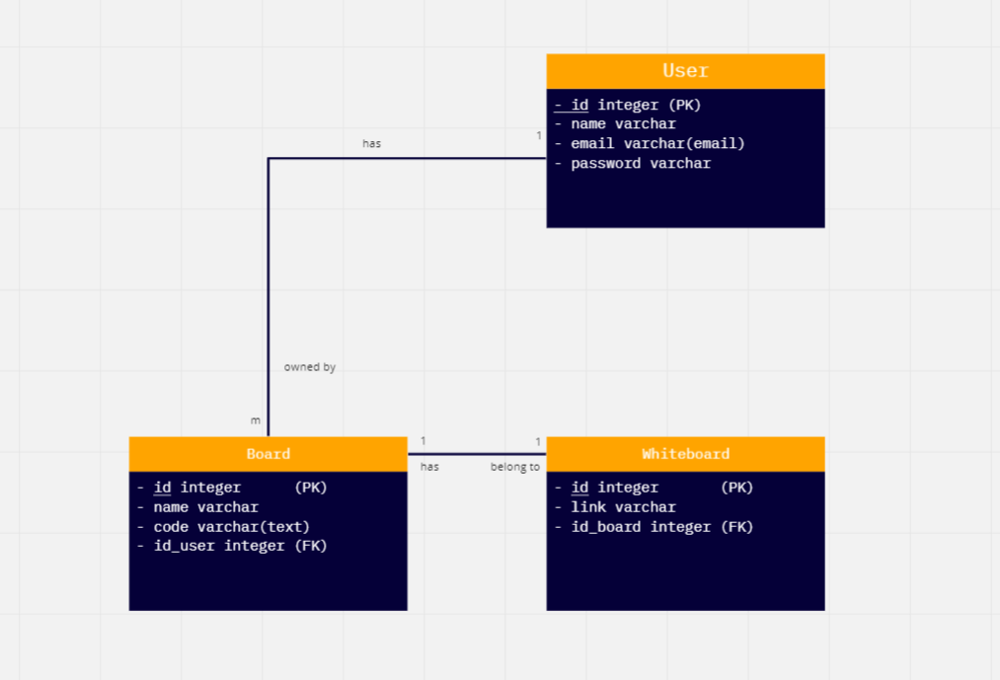
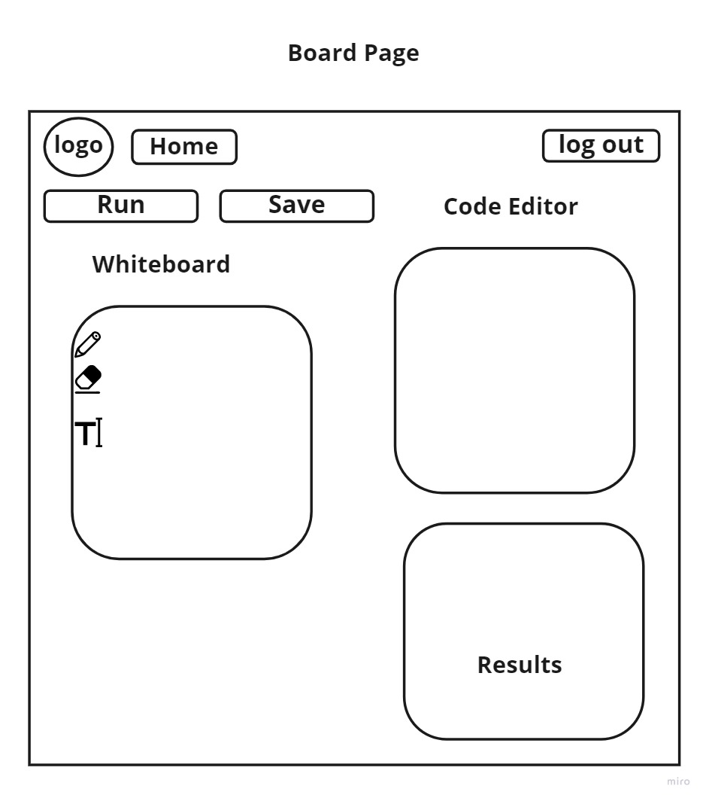
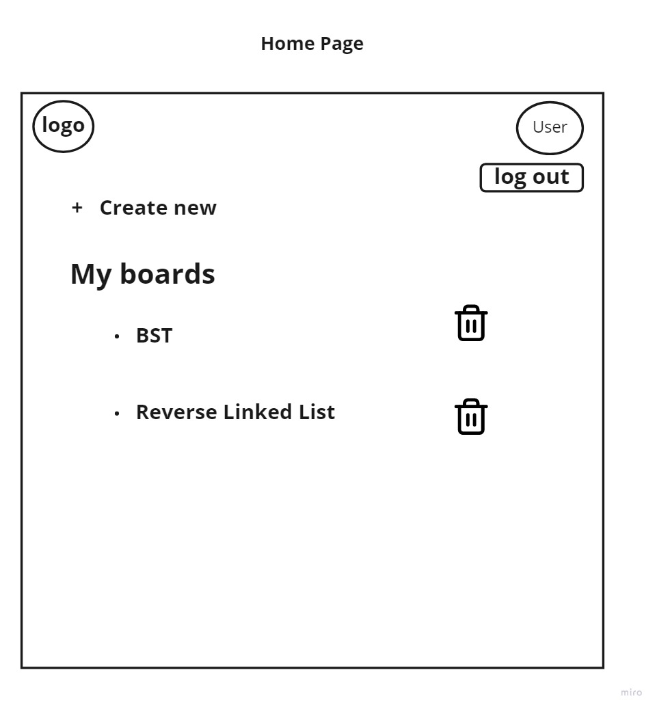
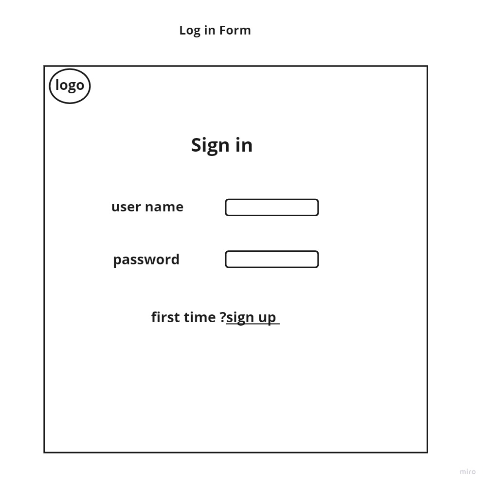
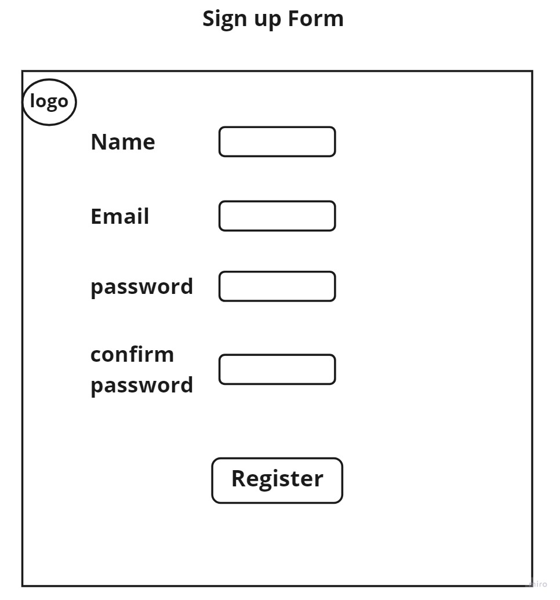

# 401-final
## Group Name :-

- **Mohammad Ashour**
- **Rawan Abu-Yasein**
- **Mohammad Momani**
- **Manar Abdelkarim**

------------------------------------------------------------------------------------------------
## **Conflict Plan**
###	What will be your group’s process to resolve conflict, when it arises?
> - Our group will meet online and talk about it and we will vote , we will respect each other’s opinions and only talk in a respectable manner. 

###	What will your team do if one person is taking over the project and not letting the other members contribute?

> - before we start we will divide the project into tasks and each one of us will take his task based on each one knowledge and every one will push his own code to Github.

###	How will you approach each other and the challenges of the project knowing that it is impossible for all members to be at the exact same place in understanding and skill level?

> - We will divide the tasks based on the preference of the team members so that the team member will be enjoying doing their task. In the dividing process We will make sure that every member will gain new knowledge.

###	How will you raise concerns to members who are not adequately contributing?

> - We can discuss why this happened also the leader will keep up with the team. Fisrt we will have to know their reasons and if their reason is acceptable we will review our backup plan and if it was not acceptable the team leader will contact the instructor as last solution.

###	How and when will you escalate the conflict if your resolution attempts are unsuccessful?

> - We can discuss the different opinions and thoughts and share them with all of the group members and then take a vote on what to do next.

> - When we fail to find a common solution together and the votes are equal and the problem is critical to the workflow we will let our instructor/TA help us with it.

------------------------------------------------------------------------------------------------

## **Cooperation Plan**
### What are the key strengths of each person on the team?

> - Manar: flexable , can help others in my free time and accept project changes.

> - Rawan: quick learning ability , ability to process information and make connections on the fly and find different resources for the team.

> - Mohammad Momani: Curiosity, able to pick up any Library and start using it with minimal ramp up time.

> - Mohammad Ashour: Critical thinking and Puzzle-solver

### In which professional competencies do you each want to develop greater strength?

> - learn about other technologies needed in building a complete product, learn how to write code better and understand concepts such as design patterns and object-oriented programming.

### Knowing that every person in your team needs to understand all aspects of the project, how do you plan to approach the day-to-day work?

> - We will have a daily meetings, these meetings allow the team to review the previous day’s work, discuss the current day’s tasks, and each person explains the progress made and quickly explains the code written for the rest of the members of the group .

----------------------------------------------------------------------------------------------

## Git Process
### What components of your project will live on GitHub?

> - All of our project expict any file in .env  
### How will you share the repository with your teammates?

> - we are all owners on the rebo  
### What is your Git flow?

> - every feature will have its own branch and the team leader will merge the pull request  
### Will you be using a PR review workflow? If so, consider:
#### How many people must review a PR? 

> - 1 
#### Who merges PRs? 

> - team leader 
#### How often will you merge? 

> - after every feature 
#### How will you communicate that it’s time to merge?

> - when every new feature is complete ,has no bugs and follow our github rules the and updated with main the request of merging will be in slack after sending pull request  

------------------------------------------------------------------------------------------------

------------------------------------------------------------------------------------------------
## **Communication Plan**

###	What hours will you be available to communicate?

> - We agreed on 9am to 5pm work time from Sunday to Wednesday.

### What platforms will you use to communicate (ie. Slack, phone …)?

> - We created a Slack group and we are using Discord and Zoom to meet

### How often will you take breaks?

> - we will have a break in the original break time on work days (12:00pm)
### What is your plan if you start to fall behind?

> - we will extend work hours and ask for aasistence 
### How will you communicate after hours and on the weekend?

> - any time ,we will use slack as our main communicate platform and we will meet at zoom at 7pm if needed
### What is your strategy for ensuring everyone's voices are heard?

> - We welcome all the different opinions and we don’t judge anyone, we are all here because we like doing the same thing which is web development. We support each other not just to finish the goal of this project but also because we are teammates. We will make sure to hear everyone opinion and encourage the members to participate

### How will you ensure that you are creating a safe environment where everyone feels comfortable speaking up?

> - When anyone speaks up about anything we will always listen and not interrupt also we will never make fun of them. We will be nice to each other and always communicate in a respectable manner
 
-----------------
## Work Plan

### How you will identify tasks, assign tasks, know when they are complete, and manage work in general?

> - using Trello we will create tasks and give each task deadline  

### What project management tool will be used?

> - Trello : [trello](https://trello.com/b/JDl50w6A/team-tech2021)

## Database Schema Diagram

## Wireframes

------------------------------------------------------------------------------------------------
